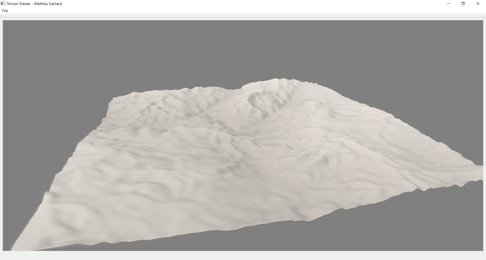

# TerrainViewerWidget
A turnkey Qt Widget to display a terrain in 3D. Tessellation is used to efficiently display the terrain, so that it runs in real time even on low-end hardware. A very efficient algorithm to approximate global illumination has been implemented based on this paper: *Timonen, Ville, and Jan Westerholm. "Scalable Height Field Self‐Shadowing." Computer Graphics Forum. Vol. 29. No. 2. Oxford, UK: Blackwell Publishing Ltd, 2010.* Tested only with Nvidia and Intel GPUs. It probably works on AMD GPUs as well.



## Getting Started
The widget does not come pre compiled in a library. You have to include files in your project and use them as explained in section "Using the Widget in your application".

### Testing the widget
If you want to test the software, the widget is wrapped in a sample application. You can either compile it or download a binary version from GitHub. To use it:
- Click on File > Load
- Select a heightmap file (8 bits or 16 bits grayscale image)
- Use the trackball camera to rotate the terrain (click and drag)

### Prerequisites
- Qt 5.9
- OpenCV 3.4

### Using the Widget in your application
```c++
using namespace TerrainViewer;
// Create the widget
TerrainViewerWidget* terrainViewer = new TerrainViewerWidget();

// Load the heightmap image
const auto image = cv::imread("terrain.png", cv::ImreadModes::IMREAD_ANYDEPTH);

// Create a terrain from the heightmap
const float width = 10.f;
const float height = 10.f;
const float maxAltitude = 1.f;
Terrain terrain(width, height, maxAltitude);
terrain.loadFromImage(image);

// Display the terrain
terrainViewer->loadTerrain(terrain);
```

## Author
Mathieu Gaillard

This software has been developed for the CGT-520 and CGT-521 classes at Purdue University.

## License
See the LICENSE file.
